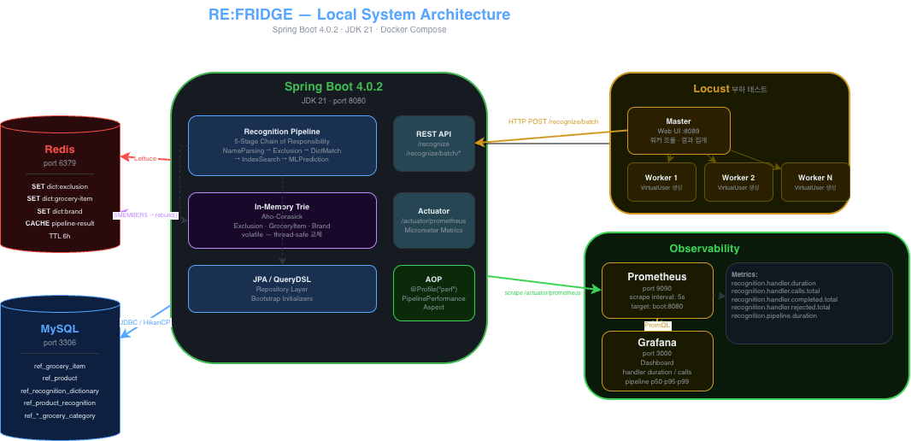
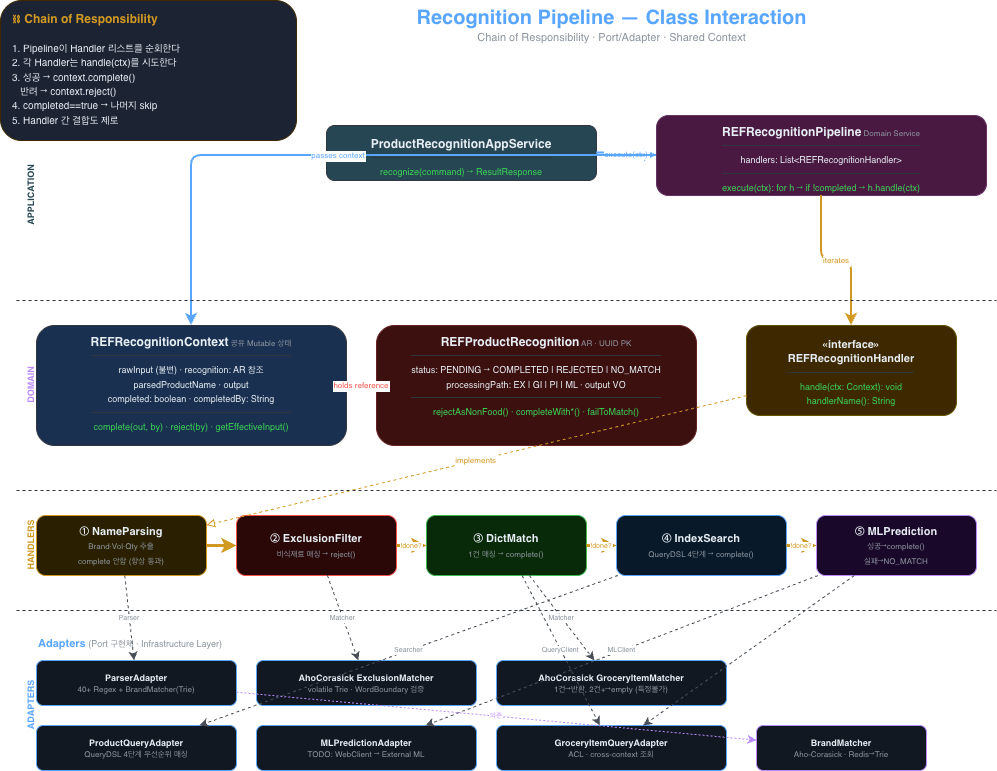
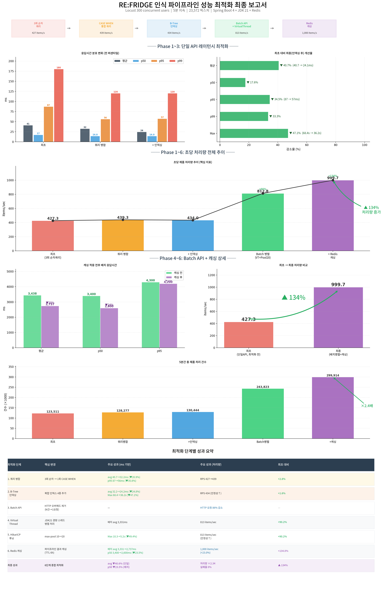

# 🧊 REF_Core_Fridge_Service

> **RE:FRIDGE**의 핵심 백엔드 서비스 — 냉장고 관리, 상품 인식, 식재료 추출을 담당하는 도메인 중심 서비스입니다.

<br>

## 📌 프로젝트 개요

**RE:FRIDGE**는 영수증 OCR, 상품명 인식, ML 기반 식재료 분류를 통해 냉장고 내 식재료를 자동으로 관리하는 풀스택 애플리케이션입니다.

**Core Fridge Service**는 이 시스템의 중추로서, 다음과 같은 핵심 책임을 수행합니다:

- **상품 인식 파이프라인** — 입력된 상품명으로부터 식재료를 자동 추출하는 5단계 Chain of Responsibility 파이프라인
- **도메인 비즈니스 로직** — 식재료, 식제품, 카테고리 정보에 관한 CRUD와 비즈니스 로직 전담
- **식료품 데이터 서비스** — 약 1,100건의 한국 식료품 상품 데이터 기반 사전·인덱스 검색 제공 (`TODO`: 23,000건으로 확대 작업 진행 중)
- **[ML 폴백 연동](https://github.com/RE-FRIDGE-Team/REF_Classification_For_Ingredient_Recognition)** — 사전/인덱스 매칭 실패 시 외부 ML 서비스를 통한 개방형 분류 (`TODO`: DAPT-KoBERT + LLM FineTuning 예정)

<br>

## 🏗️ 기술 스택

| 영역 | 기술 |
|---|---|
| Framework | Spring Boot 4.0.2 |
| Language | Java 21 (Virtual Threads) |
| Architecture | DDD (Domain-Driven Design) |
| ORM | Spring Data JPA + QueryDSL 5.1.0 |
| Cache | Redis + StringRedisTemplate |
| Observability | Micrometer + Prometheus + Grafana |
| Profiling | AOP 기반 핸들러별 레이턴시 계측, JMH 벤치마크 |
| LoadTest | Locust(Master-Slave) |
| Build | Gradle |

<br>

## 🏠 로컬 시스템 아키텍처

개발 환경에서의 전체 시스템 구성은 다음과 같습니다.



Core Fridge Service는 Flutter 클라이언트로부터 REST 요청을 수신하고, Redis 캐시 레이어를 거쳐 도메인 로직을 처리합니다. 상품 인식 요청 시에는 내부 파이프라인을 통해 단계별 매칭을 시도하며, 최종 폴백 단계에서 외부 ML 서비스(FastAPI)와 연동됩니다.

<br>

## 🔗 상품 인식 파이프라인

### 클래스 다이어그램



### 파이프라인 구조

상품 인식 파이프라인은 **Chain of Responsibility 패턴**으로 설계되어, 각 핸들러가 순차적으로 상품명을 분석하고 식재료를 추출합니다. 어느 단계에서든 유효한 결과가 도출되면 체인이 즉시 종료됩니다.

```
입력(상품명)
  │
  ▼
┌─────────────────────────────────┐
│ 1. Exclusion Filter Handler     │  ← 비식품(세제, 비닐 등) 사전 필터링
└──────────────┬──────────────────┘
               ▼
┌─────────────────────────────────┐
│ 2. Name Parser Handler          │  ← 브랜드·노이즈 제거, 핵심 식재료명 추출
└──────────────┬──────────────────┘
               ▼
┌─────────────────────────────────┐
│ 3. Dictionary Match Handler     │  ← 정제된 이름으로 식재료 사전 정확 매칭
└──────────────┬──────────────────┘
               ▼
┌─────────────────────────────────┐
│ 4. Product Index Search Handler │  ← 상품 인덱스 DB 유사도 검색 (Bottleneck)
└──────────────┬──────────────────┘
               ▼
┌─────────────────────────────────┐
│ 5. ML Prediction Handler        │  ← 외부 ML 서비스 폴백 (TODO: DAPT-KoBERT)
└─────────────────────────────────┘
```

### 핸들러별 역할

| 순서 | 핸들러 | 역할 | 비고 |
|:---:|---|---|---|
| 1 | **ExclusionFilterHandler** | 비식품 키워드(세제, 봉투, 건전지 등) 감지 시 즉시 `NO_MATCH` 반환 | 불필요한 파이프라인 진입 차단 |
| 2 | **NameParserHandler** | Aho-Corasick 기반 브랜드 매칭, 40+ 정규식 노이즈 패턴 제거, 핵심 식재료명 정제 | Early-skip 최적화 적용 |
| 3 | **DictionaryMatchHandler** | 정제된 이름으로 인메모리 식재료 사전과 정확 매칭 시도 | 사전 타입별 Strategy 패턴 |
| 4 | **ProductIndexSearchHandler** | 상품 인덱스 DB 대상 유사도 기반 검색 | 레이턴시 병목 구간 |
| 5 | **MLPredictionHandler** | 외부 ML 서비스 호출을 통한 개방형 식재료 분류 | Confidence 기반 라우팅 |

<br>

## ⚡ 성능 최적화

### 계측 인프라

파이프라인 성능 분석을 위해 다음과 같은 관측 인프라를 구축했습니다:

- **Micrometer + AOP** — `@Profile("perf")` 환경에서 각 핸들러의 실행 시간을 자동 계측
- **Prometheus** — 핸들러별 레이턴시, 호출 빈도, 매칭 결과(HIT/NO_MATCH) 메트릭 수집
- **Grafana 대시보드** — PromQL 기반 실시간 시각화 및 병목 구간 식별
- **JMH 벤치마크** — Spring Context 통합 환경에서의 마이크로벤치마크 수행

### 최적화 결과



성능 프로파일링을 통해 **ProductIndexSearchHandler**가 전체 파이프라인 레이턴시의 주요 병목임을 식별했습니다. 이를 기반으로 다음과 같은 최적화를 진행했습니다:

- 사전 매칭 단계(Handler 1~3)에서의 조기 종료율을 높여 인덱스 검색 진입 빈도 자체를 감소
- Name Parser의 Early-skip 로직 강화로 불필요한 정규식 평가 단계 축소
- Dictionary Match 단계의 인메모리 사전 구조 최적화

Grafana 대시보드 지표를 통해 최적화 전후의 핸들러별 레이턴시 분포, 매칭 성공률 변화, 전체 파이프라인 처리량 개선을 정량적으로 확인할 수 있습니다.

<br>

## 📂 프로젝트 구조

```
src/main/java/com/ref/fridge/
├── domain/                    # 도메인 계층
│   ├── fridge/                #   냉장고 Aggregate Root, Value Objects
│   ├── grocery/               #   식료품 도메인
│   └── recognition/           #   상품 인식 도메인 (Pipeline, Handlers)
├── application/               # 서비스 계층
│   ├── service/               #   Command / Query 서비스
│   └── dto/                   #   Command, Query, Result DTO
├── infrastructure/            # 인프라 계층
│   ├── persistence/           #   JPA Repository 구현체
│   ├── redis/                 #   RedisCacheService (Generic)
│   ├── recognition/           #   핸들러 인프라 구현체
│   └── bootstrap/             #   ApplicationRunner 기반 데이터 초기화
└── interfaces/                # 인터페이스 계층
    └── api/                   #   REST Controller
```

<br>

## 🚀 실행 방법

### 사전 요구사항

- **JDK 21**+
- **Docker** (Redis, Prometheus, Grafana 컨테이너)
- `.env` 파일 설정 (`springboot4-dotenv` 사용)

### 로컬 실행

```bash
# 인프라 컨테이너 기동
docker-compose up -d

# 애플리케이션 실행
./gradlew bootRun

# 성능 프로파일링 모드 실행
./gradlew bootRun --args='--spring.profiles.active=perf'
```

### JMH 벤치마크

```bash
./gradlew jmh
```

<br>

## 📄 License

This project is part of the **RE:FRIDGE** system.
